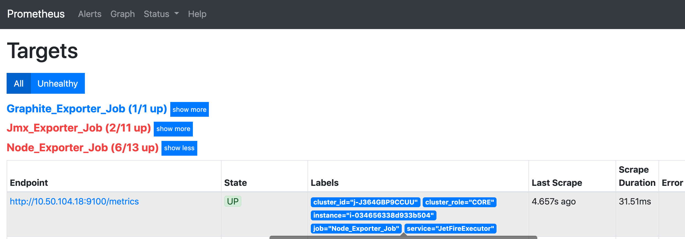
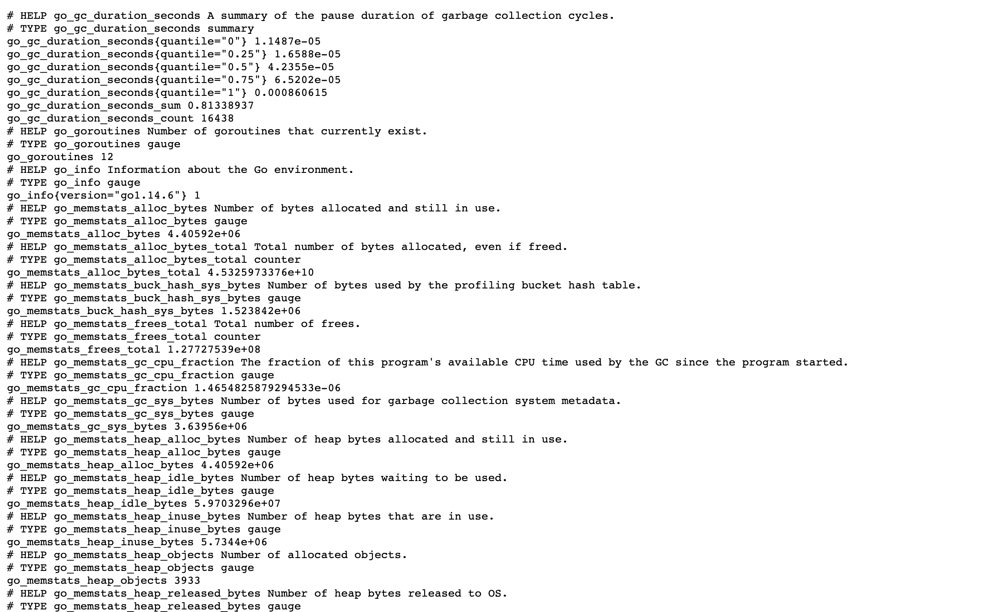
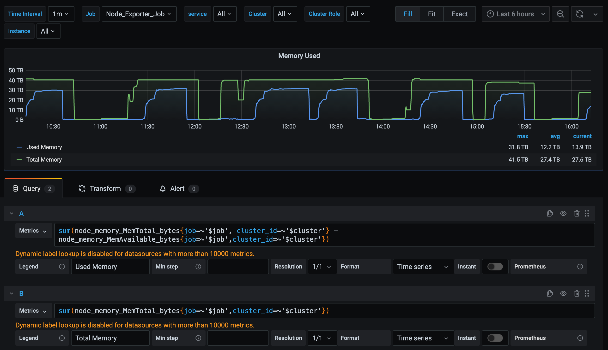
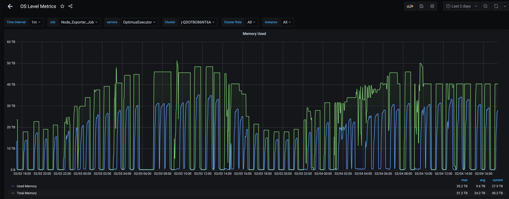

# 从零开始在EMR上搭建Prometheus

## 1. 什么是Prometheus
	Prometheus(普罗米修斯)是一款非常好用的开源监控工具，FreeWheel大数据团队在搭建数据仓库的过程中，使用Prometheus+Grafana来对整个系统进行监控。
	Prometheus支持多维度的指标数据模型，服务端通过HTTP协议定时拉取数据，然后给用户提供灵活的查询语言PromQL，实现监控的目的。客户端记录相关数据，
	并提供对外查询接口，服务端则通过服务器发现客户端，并定时抓取时序数据，最后通过可视化工具加以展现。本文将从Prometheus监控的实例角度，
	给大家讲述一下FreeWheel Transformer团队如何从零搭建起一套比较完整的监控系统。其官方的整体架构如下图：

	

## 2. 什么是EMR集群
	Amazon EMR 是一个托管集群平台，可简化在 AWS 上运行大数据框架（如 Apache Hadoop 和 Apache Spark）以处理和分析海量数据的操作
	，Freewheel的Transformer 团队的Spark业务正是运行在EMR集群上的，由于我们核心服务都迁移到EMR上了，所以对EMR集群的实时监控非常重要，
	比如磁盘，内存的实时状态，集群是否稳定等等都会对线上的Pipeline造成很大的影响；另一方面，为了充分利用集群资源，做好Cost-Saving
	也需要知道当前EMR的系统资源利用率是否浪费或者不足，以便进行调整。关于EMR的具体介绍，可以学习一下我同事写的文章：
	
https://github.com/pkexcellent/articles/blob/main/EMR%E5%AE%9E%E8%B7%B5/AWS%20EMR%E5%9C%A8FreeWheel%E7%9A%84%E6%9C%80%E4%BD%B3%E5%AE%9E%E8%B7%B5.md

## 3. 什么是Exporter
	一般Prometheus提供监控数据的程序都可以成为一个Exporter的，一个Exporter的实例称为Target, 现有的Prometheus生态中Exporter可以在官网查看，非常丰富
https://prometheus.io/docs/instrumenting/exporters/

### 3.1 Node Exporter
	Prometheus Exporter生态的一员，用Go编写，使用可插入的指标收集器，采集Linux内核公开的硬件和操作系统指标。如果要公开NVIDIA GPU指标，可以使用prometheus-dcgm。
https://github.com/prometheus/node_exporter

	我们需要在EMR的每台机器上都安装 node exporter来采集相关的指标信息，所以我们会在EMR的Bootstrap脚本（可用于在EMR 集群中运行引导操作，在EMR 在集群实例上安装和配置开源大数据应用程序之前，您可以使用引导操作来为所有集群节点安装软件和配置EC2实例）里面来进行设置，具体的操作如下：
**step 1: Download node_exporter release from original repo** 

	sudo useradd --no-create-home --shell /bin/false node_exporter
	cd /tmp
	sudo wget https://github.com/prometheus/node_exporter/releases/download/v1.0.0/node_exporter-1.0.0.linux-amd64.tar.gz
	tar -xvzf node_exporter-1.0.0.linux-amd64.tar.gz
	cd node_exporter-1.0.0.linux-amd64
	sudo cp node_exporter /usr/local/bin/
	cd /tmp
	sudo chown node_exporter:node_exporter /usr/local/bin/node_exporter

**step 2: Add node_exporter as systemd service**

	sudo tee /etc/systemd/system/node_exporter.service << END
	[Unit]
	Description=Node Exporter

	[Service]
	User=node_exporter
	Group=node_exporter
	ExecStart=/usr/local/bin/node_exporter $OPTIONS

	[Install]
	WantedBy=multi-user.target
	END
	sudo chown node_exporter:node_exporter /etc/systemd/system/node_exporter.service
	sudo systemctl daemon-reload
	sudo systemctl start node_exporter
	sudo systemctl enable node_exporter

### 3.2 JMX Exporter
	JMX Exporter 是Prometheus生态系统中的一员，该采集器可以可配置地抓取和公开JMX目标的mBean。该Exporter作为Java代理运行，公开HTTP服务器并提供本地JVM的度量。 
	它也可以作为独立的HTTP服务器运行，并scrape远程JMX目标。我们同样需要在EMR集群的每台机器上进行配置，配置的方式和Node Exporter 一样，基于Bootstrap脚本进行，
https://github.com/prometheus/jmx_exporter

	具体步骤如下：
	
**step 1: Download jmx_exporter release from original repo**

	#3. set up jmx_exporter for HDFS application metrics
	sudo mkdir -p /etc/prometheus/hadoop/conf
	sudo wget -P /etc/prometheus https://repo1.maven.org/maven2/io/prometheus/jmx/jmx_prometheus_javaagent/0.13.0/jmx_prometheus_javaagent-0.13.0.jar

**step 2: write jmx_exporter metrics name_node and data_node mapping conf**

	sudo tee /etc/prometheus/hadoop/conf/hdfs_jmx_config_namenode.yaml << END
	lowercaseOutputName: true
	lowercaseOutputLabelNames: true
	rules:
	  # RPC
	  - pattern: 'Hadoop<service=(.*), name=RpcActivityForPort([^\W>]+)><>([\w.]+)'
	    attrNameSnakeCase: true
	    name: rpc_activity_$3
	    labels:
	      role: "$1"
	      port: "$2"
	  # Log
	  - pattern: 'Hadoop<service=(.*), name=JvmMetrics><>Log(Warn|Fatal|Info|Error)'
	    name: log_$2
	    labels:
	      role: $1
	  # MetricsSystem
	  - pattern: 'Hadoop<service=(.*), name=MetricsSystem, sub=(.*)><>(.*): (\d+)'
	    attrNameSnakeCase: true
	    name: hdfs_$1_$3
	    value: $4
	    labels:
	      role: $1
	      kind: 'MetricsSystem'
	      sub: $2
	    type: GAUGE
	  # All NameNode infos
	  - pattern: 'Hadoop<service=(.*), name=(.*)><>(.*): (\d+)'
	    attrNameSnakeCase: true
	    name: hdfs_$1_$3
	    value: $4
	    labels:
	      role: $1
	      kind: $2
	    type: GAUGE
	  - pattern: '.*'
	END
	
	
	sudo tee /etc/prometheus/hadoop/conf/hdfs_jmx_config_datanode.yaml << END
	lowercaseOutputName: true
	lowercaseOutputLabelNames: true
	rules:
	  # RPC
	  - pattern: 'Hadoop<service=(.*), name=RpcActivityForPort([^\W>]+)><>([\w.]+)'
	    attrNameSnakeCase: true
	    name: rpc_activity_$3
	    labels:
	      role: "$1"
	      port: "$2"
	  # Log
	  - pattern: 'Hadoop<service=(.*), name=JvmMetrics><>Log(Warn|Fatal|Info|Error)'
	    name: log_$2
	    labels:
	      role: $1
	  # MetricsSystem
	  - pattern: 'Hadoop<service=(.*), name=MetricsSystem, sub=(.*)><>(.*): (\d+)'
	    attrNameSnakeCase: true
	    name: hdfs_$1_$3
	    value: $4
	    labels:
	      role: $1
	      kind: 'MetricsSystem'
	      sub: $2
	    type: GAUGE
	  # FSDatasetState (also extracts the FSDataset ID)
	  - pattern: 'Hadoop<service=(.*), name=FSDatasetState-(.*)><>(.*): (\d+)'
	    attrNameSnakeCase: true
	    name: hdfs_$1_$3
	    value: $4
	    labels:
	      role: $1
	      fsdatasetid: $2
	      kind: 'FSDatasetState'
	    type: GAUGE
	  # DataNodeActivity (also extracts hostname and port)
	  - pattern: 'Hadoop<service=(.*), name=DataNodeActivity-(.*)-(\d+)><>(.*): (\d+)'
	    attrNameSnakeCase: true
	    name: hdfs_$1_$4
	    value: $5
	    labels:
	      role: $1
	      host: $2
	      port: $3
	      kind: 'DataNodeActivity'
	    type: GAUGE
	  # All other services
	  - pattern: 'Hadoop<service=(.*), name=(.*)><>(.*): (\d+)'
	    attrNameSnakeCase: true
	    name: hdfs_$1_$3
	    value: $4
	    labels:
	      role: $1
	      kind: $2
	    type: GAUGE
	  - pattern: '.*'
	END
	
**step 3: Add jmx_exporter's as javaagent in EMR Clsuter**

	该Exporter程序可以作为Java代理运行，公开HTTP服务器并提供本地JVM的度量。 它也可以作为独立的HTTP服务器运行，并scrape远程JMX目标，但这有许多缺点，
	例如难以配置和无法公开进程指标（例如，内存和CPU使用率）。因此我们将jmx exporter 运行程序和Name Node 以及Data Node服务进行关联，将Exporter程序作为Java代理运行。
	具体的操作如下，我们需要在EMR的configurations_json 里面进行如下配置：

	{
		"Classification":"hadoop-env",
		"Configurations": [
		    {
			"Classification": "export",
			"Properties": {
			    "HDFS_NAMENODE_OPTS": "\"-javaagent:/etc/prometheus/jmx_prometheus_javaagent-0.13.0.jar=7001:/etc/prometheus/hadoop/conf/hdfs_jmx_config_namenode.yaml -Dcom.sun.management.jmxremote -Dcom.sun.management.jmxremote.ssl=false -Dcom.sun.management.jmxremote.authenticate=false -Dcom.sun.management.jmxremote.port=50103\"",
			    "HDFS_DATANODE_OPTS": "\"-javaagent:/etc/prometheus/jmx_prometheus_javaagent-0.13.0.jar=7001:/etc/prometheus/hadoop/conf/hdfs_jmx_config_datanode.yaml -Dcom.sun.management.jmxremote -Dcom.sun.management.jmxremote.ssl=false -Dcom.sun.management.jmxremote.authenticate=false -Dcom.sun.management.jmxremote.port=50103\""
			}
		    }
		],
		"Properties":{}
	}

## 4. 如何收集EMR集群的指标
	    因为Prometheus只支持pull模式的方式去收集数据，所以我们需要通过声明Prometheus配置文件中的scrape_configs，来指定Prometheus在运行时需要拉取指标的目标，
	目标实例需要实现一个可以被Prometheus进行轮询的端点接口，而Exporter正是用来提供这样接口的，比如用来拉取操作系统指标的Node Exporter，
	它会从操作系统上收集硬件指标，供Prometheus来Pull，具体的部署结构如下图所示：

	我们需要搭建安装Prometheus，安装过程非常简单，大家可以参考下面的步骤：
**step 1: Download Prometheus release from original repo**

	#install Prometheus
	sudo useradd --no-create-home --shell /bin/false prometheus
	sudo mkdir -p /etc/prometheus/conf
	sudo chown -R prometheus:prometheus /etc/prometheus
	cd /tmp
	wget https://github.com/prometheus/prometheus/releases/download/v2.20.0/prometheus-2.20.0.linux-amd64.tar.gz
	tar xvf prometheus-2.20.0.linux-amd64.tar.gz
	cd prometheus-2.20.0.linux-amd64
	sudo cp prometheus /usr/local/bin/
	sudo cp promtool /usr/local/bin/
	sudo cp tsdb /usr/local/bin/
	sudo cp -r consoles /etc/prometheus
	sudo cp -r console_libraries /etc/prometheus
	sudo chown prometheus:prometheus /usr/local/bin/prometheus
	sudo chown prometheus:prometheus /usr/local/bin/promtool
	sudo chown prometheus:prometheus /usr/local/bin/tsdb
	sudo chown -R prometheus:prometheus /etc/prometheus/consoles
	sudo chown -R prometheus:prometheus /etc/prometheus/console_libraries

**step 2: Add Prometheus's as systemd service**

	[Unit]
	Description=Prometheus
	Wants=network-online.target
	After=network-online.target

	[Service]
	User=prometheus
	Group=prometheus
	Type=simple
	ExecStart=/usr/local/bin/prometheus --config.file=/etc/prometheus/conf/prometheus.yml --storage.tsdb.path=/var/lib/prometheus/ --web.console.templates=/etc/prometheus/consoles --web.console.libraries=/etc/prometheus/console_libraries

	Restart=always

	[Install]
	WantedBy=multi-user.target

**step 3: Config for Prometheus**

	global:
	  #How frequently to scrape targets
	  scrape_interval:     15s # By default, scrape targets every 15 seconds.

	  #How frequently to evaluate rules
	  evaluation_interval: 5s

	  #Attach these labels to any time series or alerts when communicating with
	  #external systems (federation, remote storage, Alertmanager).
	  external_labels:
	    monitor: 'emr'

	# Rules and alerts are read from the specified file(s)
	#rule_files:
	#  - rules.yml

	# Alerting specifies settings related to the Alertmanager
	#alerting:
	#  alertmanagers:
	#    - scheme: http
	#      static_configs:
	#        - targets: ['xxx.xxx.xxx.xxx:9093']

	# A scrape configuration containing exactly one endpoint to scrape:
	# Here it's Prometheus itself.
	scrape_configs:

	  # Graphite_Exporter_Job is designed to collect Spark metrics
	  - job_name: 'Graphite_Exporter_Job'
	    # metrics_path defaults to '/metrics'
	    # scheme defaults to 'http'.

	    static_configs:
	      - targets: ['xxx.xxx.xxx.xxx:9108']

	  # Node_Exporter_Job is designed to collect OS system level metrics
	  - job_name: 'Node_Exporter_Job'
	    # Override the global default and scrape targets from this job every 15 seconds.
	    scrape_interval: 15s

	    ec2_sd_configs:
	      - region: us-east-1
		profile: your-emr-role-profile-name
		port: 9100
		filters:
		  - name: tag:Project
		    values:
		      - Transformer

	    relabel_configs:
	      - source_labels: [__meta_ec2_tag_aws_elasticmapreduce_instance_group_role]
		target_label: cluster_role
	      #Use instance ID as the instance label instead of private ip:port
	      - source_labels: [__meta_ec2_instance_id]
		target_label: instance
	      - source_labels: [__meta_ec2_tag_aws_elasticmapreduce_job_flow_id]
		target_label: cluster_id
	      - source_labels: [__meta_ec2_tag_Service]
		target_label: service

	  # Jmx_Exporter_Job is designed to collect java application such HDFS metrics
	  - job_name: 'Jmx_Exporter_Job'
	    # Override the global default and scrape targets from this job every 15 seconds.
	    scrape_interval: 15s

	    ec2_sd_configs:
	      - region: us-east-1
		profile: your-emr-role-profile-name
		port: 7001
		filters:
		  - name: tag:Project
		    values:
		      - Transformer
		  - name: tag:Service
		    values:
		      - OptimusExecutor
	    relabel_configs:
	      #This job is for monitoring CORE and TASK nodes, so drop MASTER node.
	      - source_labels: [__meta_ec2_tag_aws_elasticmapreduce_instance_group_role]
		regex: MASTER
		action: drop
		#Use instance ID as the instance label instead of private ip:port
	      - source_labels: [__meta_ec2_instance_id]
		target_label: instance
	      - source_labels: [__meta_ec2_tag_aws_elasticmapreduce_job_flow_id]
		: cluster_id
	      - source_labels: [__meta_ec2_tag_Service]
		target_label: service
		
	这里最重要的就是第3步， Prometheus pull时，可以通过static_configs参数配置的静态配置目标或者受支持的服务发现机制动态地发现目标。我们安装配置完之后，
	可以通过Prometheus server的9090端口，查询具体的服务发现的结果，正常情况下会是这样：

		
	对于某些Exporter我们也可以访问具体的API 直接查看相关的metrics，这里以Graphate Exporter为例子，xxx.xxx.xxx.xxx:9108/metrics
	

	到这里整个Prometheus 监控架构基本都搭建完成了，接下来，我们需要看一下如何对采集到的metrics 进行查询。

## 5. 指标数据的查询介绍
### 5.1 PromQL
	PromQL（Prometheus Query Language）是 Prometheus 自己开发的表达式语言，语言表现力很丰富，内置函数也很多。使用它可以对时序数据进行筛选和聚合。
	PromQL 表达式计算出来的值有以下几种类型：

		瞬时向量 (Instant vector): 一组时序，每个时序只有一个采样值
		区间向量 (Range vector): 一组时序，每个时序包含一段时间内的多个采样值
		标量数据 (Scalar): 一个浮点数
		字符串 (String): 一个字符串，暂时未用
	
#### 5.2 时序选择器

**a.瞬时向量选择器**

	瞬时向量选择器用来选择一组时序在某个采样点的采样值,比如下面的表达式：
	node_memory_MemAvailable_bytes{job=~'$job',service='optimusExecutor',cluster_id=~'$cluster'}
	
	度量指标名可以使用内部标签 __name__ 来匹配:
	表达式 node_memory_MemAvailable_bytes 也可以写成 {__name__="node_memory_MemAvailable_bytes"}。
	表达式 {__name__=~"job:.*"} 表示匹配所有度量指标名称以 job: 打头的时序。
	
	注意： = (完全相等)，!= (不相等)，=~ (正则表达式匹配)，!~ (正则表达式不匹配)
	
**b.区间向量选择器**

	区间向量选择器是选择过去一段时间的采样值。可以通过在瞬时向量选择器后面添加包含在 [] 里的时长来得到区间向量选择器。eg: 
		node_memory_MemAvailable_bytes{job="Node_Exporter_Job",service='optimusExecutor'}[5m]   //job为Node_Exporter_Job, service为optimusExecutor的时序在过去 5分钟的采样值
		
**c.偏移修饰器**

	前面介绍的选择器默认都是以当前时间为基准时间，偏移修饰器用来调整基准时间，使其往前偏移一段时间。偏移修饰器紧跟在选择器后面，使用 offset 来指定要偏移的量。
		node_memory_MemAvailable_bytes offset 5m       //node_memory_MemAvailable_bytes 的所有时序在 5 分钟前的采样值。
		node_memory_MemAvailable_bytes[5m] offset 1w   //下面的表达式选择 node_memory_MemAvailable_bytes 度量指标在 1 周前的这个时间点过去 5 分钟的采样值。

#### 5.3 操作符

**a.算术类**

	算术类二元操作符有以下几种：
		+, -, *, /, %, ^
	算术类二元操作符可以使用在标量与标量、向量与标量，以及向量与向量之间,二元操作符上下文里的向量特指瞬时向量，不包括区间向量。

	标量与标量之间，结果很明显，跟通常的算术运算一致。
	向量与标量之间，相当于把标量跟向量里的每一个标量进行运算，这些计算结果组成了一个新的向量。
	向量与向量之间，会稍微麻烦一些。运算的时候首先会为左边向量里的每一个元素在右边向量里去寻找一个匹配元素（匹配规则后面会讲），然后对这两个匹配元素执行计算，这样每对匹配元素的计算结果组成了一个新的向量。如果没有找到匹配元素，则该元素丢弃。

**b.逻辑类**

	逻辑操作符仅用于向量与向量之间,具体有：and(交集)，or(合集)，unless(补集)
	规则如下：
		vector1 and vector2 的结果由在 vector2 里有匹配（标签键值对组合相同）元素的 vector1 里的元素组成。
		vector1 or vector2 的结果由所有 vector1 里的元素加上在 vector1 里没有匹配（标签键值对组合相同）元素的 vector2 里的元素组成。
		vector1 unless vector2 的结果由在 vector2 里没有匹配（标签键值对组合相同）元素的 vector1 里的元素组成。
	
### 5.4 聚合操作符及辅助函数
	PromQL 提供了比较丰富的聚合操作符：sum（求和），min（最小值），max（最大值），avg（平均值），stddev（标准差），stdvar（方差），count（元素个数），count_values（等于某值的元素个数），bottomk（最小的 k 个元素），topk（最大的 k 个元素），quantile（分位数）等等。聚合操作符语法如下：
		<aggr-op>([parameter,] <vector expression>) [without|by (<label list>)] 
	eg：
		sum(node_memory_MemAvailable_bytes) without (instance)
		sum(node_memory_MemAvailable_bytes) by (application, group)
	Prometheus 内置了一些函数来辅助计算，如：abs(),sqrt(),exp(),ln(),ceil(),floor(),round(),delta(),sort()等等。

https://prometheus.io/docs/prometheus/latest/querying/basics/

### 6 Grafana配置及可视化效果

	    现有的数据可视化工具很多，比如Prometheus 本身自带的可视化工具，我们可以访问Prometheus server的9090端口，在UI上对数据进行可视化编辑，
	但通常很难使用图形和仪表板编辑功能，Prometheus利用控制台模板进行可视化和仪表板编辑，但这些控制台模板的学习曲线起初可能很难。
	
	    现在比较主流的数据可视化工具是Grafana(http://docs.grafana.org/)，其在可视化和仪表板创建和定制方面是最好的选择，而且功能丰富，易于使用，
	而且非常灵活，目前主要用于大规模指标数据的可视化展现，是网络架构和应用分析中最流行的时序数据展示工具，目前已经支持绝大部分常用的时序数据库。
	Grafana支持许多不同的数据源。
	
	    每个数据源都有一个特定的查询编辑器，官方支持以下数据源:Graphite，Elasticsearch，InfluxDB，Prometheus，
	Cloudwatch，MySQL和OpenTSDB等。每个数据源的查询语言和能力都是不同的。你可以把来自多个数据源的数据组合到一个仪表板，但每一个面板被绑定到一个特定的数据源,
	它就属于一个特定的组织，这里我们主要是使用Prometheus数据源。
	
	在定义Query类型变量时，除了使用PromQL查询时间序列以过滤标签的方式以外，Grafana还提供了几个有用的函数：
	
			label_values(label) 	    返回Promthues所有监控指标中，标签名为label的所有可选值
			label_values(metric,label)  返回Promthues所有监控指标metric中，标签名为label的所有可选值
			metrics(metric)	    	    返回所有指标名称满足metric定义正则表达式的指标名称
			query_result(query)         返回prometheus查询语句的查询结果
	
	当需要监控Prometheus所有采集任务的状态时，可以使用如下方式获取当前所有采集任务的名称：
			label_values(up, job)	
			

	下面就是整个monitor最终的效果图了，具体的dashboard可以参考下面的link

	
https://github.com/pxchen00/Prometheus-on-EMR/tree/Prometheus-on-EMR-pre/dashboards

