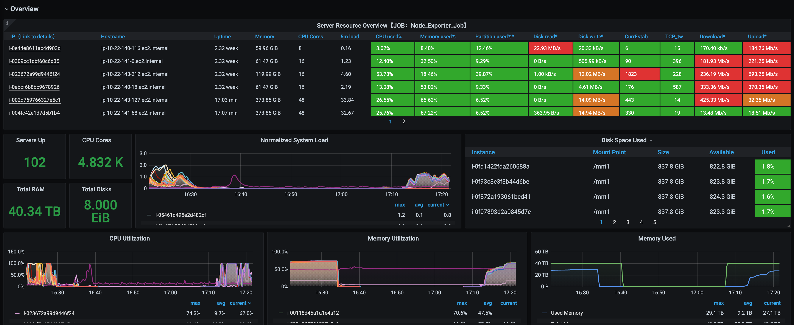

# Prometheus在EMR上是实践

## 1. 什么是Prometheus
	Prometheus(普罗米修斯)这款开源监控工具，名字和功能一样酷，本文是一个干货入门，动手来部署一个实验环境。用Prometheus+Grafana来监控EMR。
	首先Prometheus，它支持多维度的指标数据模型，服务端通过HTTP协议定时拉取数据后，通过灵活的查询语言，实现监控的目的。客户端记录相关数据，
	并提供对外查询接口，服务端则通过服务器发现客户端，并定时抓取形成时序数据存储起来，最后通过可视化工具加以展现，其整体架构如下图：

## 2. 为什么需要监控EMR集群
	为了充分利用集群资源，我们需要对集群状态有非常深刻的了解，由于team的Spark业务是run在EMR集群上面的，我们需要对整个EMR集群的运行状态有管理，
	比如磁盘的状态，内存的状态，集群是否稳定等等，都会对我们的pipeline 造成很大的影响；另一方面，我们也是为了能够充分的利用集群资源，做好cost saving.

## 3. Exporter和EMR集群的集成
### 3.1 Graphite Exporter
	纯文本协议中导出的指标的导出器。 它通过TCP和UDP接收数据，并进行转换并将其公开以供Prometheus使用。该导出器对于从现有Graphite设置导出度量标准以及核心Prometheus导出器（例如Node Exporter）未涵盖的度量标准非常有用。https://github.com/prometheus/graphite_exporter, 下面是安装 Graphite Exporter 的流程:
#### step 1 Download node_exporter release from original repo
	curl -L -O  https://github.com/prometheus/graphite_exporter/releases/download/v0.9.0/graphite_exporter-0.9.0.linux-amd64.tar.gz
	tar -xzvf graphite_exporter-0.9.0.linux-amd64.tar.gz
	sudo cp graphite_exporter-0.9.0.linux-amd64/graphite_exporter /usr/local/bin/
	rm -rf graphite_exporter-0.9.0.linux-amd64.tar.gz
	rm -rf graphite_exporter-0.9.0.linux-amd64
#### step 2 Add graphite_exporter's mapping file
	sudo mkdir -p /etc/graphite_exporter
	sudo tee /etc/graphite_exporter/graphite_exporter_mapping << END
	mappings:
	- match: '*.*.executor.filesystem.*.*'
	  name: filesystem_usage
	  labels:
	    application: \$1
	    executor_id: \$2
	    fs_type: \$3
	    qty: \$4

	- match: '*.*.jvm.*.*'
	  name: jvm_memory_usage
	  labels:
	    application: \$1
	    executor_id: \$2
	    mem_type: \$3
	    qty: \$4

	- match: '*.*.executor.jvmGCTime.count'
	  name: jvm_gcTime_count
	  labels:
	    application: \$1
	    executor_id: \$2

	- match: '*.*.jvm.pools.*.*'
	  name: jvm_memory_pools
	  labels:
	    application: \$1
	    executor_id: \$2
	    mem_type: \$3
	    qty: \$4

	- match: '*.*.executor.threadpool.*'
	  name: executor_tasks
	  labels:
	    application: \$1
	    executor_id: \$2
	    qty: \$3

	- match: '*.*.BlockManager.*.*'
	  name: block_manager
	  labels:
	    application: \$1
	    executor_id: \$2
	    type: \$3
	    qty: \$4

	- match: DAGScheduler.*.*
	  name: DAG_scheduler
	  labels:
	    type: \$1
	    qty: \$2
	END

#### step 3 Add graphite_exporter as systemd service
	sudo tee /etc/systemd/system/graphite_exporter.service << END
	[Unit]
	Description=Graphite Exporter
	Wants=network-online.target
	After=network-online.target

	[Service]
	User=ec2-user
	Group=ec2-user
	ExecStart=/usr/local/bin/graphite_exporter --graphite.mapping-config=/etc/graphite_exporter/graphite_exporter_mapping.yaml

	Restart=always

	[Install]
	WantedBy=multi-user.target
	END
	sudo chown -R ec2-user:ec2-user /etc/graphite_exporter/
	sudo systemctl daemon-reload
	sudo systemctl start graphite_exporter
	sudo systemctl enable graphite_exporter
	

### 3.2 JMX Exporter
	JMX到Prometheus导出器：一个收集器，该收集器可以可配置地抓取和公开JMX目标的mBean。该导出程序旨在作为Java代理运行，公开HTTP服务器并提供本地JVM的度量。 
	它也可以作为独立的HTTP服务器运行，并scrape远程JMX目标，但这有许多缺点，例如难以配置和无法公开进程指标（例如，内存和CPU使用率）。 
	因此，强烈建议将导出程序作为Java代理运行。
	https://github.com/prometheus/jmx_exporter

### 3.3 Node Exporter
	Prometheus导出程序，用于* NIX内核公开的硬件和操作系统指标，使用可插入的指标收集器用Go编写。
	建议Windows用户使用Windows导出程序。 要公开NVIDIA GPU指标，可以使用prometheus-dcgm。
	https://github.com/prometheus/node_exporter

	目前我们只集成这3种Exporter, 具体的集成方式：
	step 1. 在build 

## 4. 指标的收集
	因为Prometheus只支持pull模式的方式去收集数据，所以我们需要通过声明Prometheus配置文件中的scrape_configs，
	来指定Prometheus在运行时需要拉取指标的目标，目标实例需要实现一个可以被Prometheus进行轮询的端点接口，而Exporter正是用来提供这样接口的，
	比如用来拉取操作系统指标的Node Exporter，它会从操作系统上收集硬件指标，供Prometheus来拉取。Prometheus pull时，
	可以通过static_configs参数配置静态配置目标，也可以使用受支持的服务发现机制之一动态发现目标。下面是一个完整的Prometheus配置：
	
	global:
	  #How frequently to scrape targets
	  scrape_interval:     15s # By default, scrape targets every 15 seconds.

	  #How frequently to evaluate rules
	  evaluation_interval: 5s

	  #Attach these labels to any time series or alerts when communicating with
	  #external systems (federation, remote storage, Alertmanager).
	  external_labels:
	    monitor: 'emr'

	# Rules and alerts are read from the specified file(s)
	#rule_files:
	#  - rules.yml

	# Alerting specifies settings related to the Alertmanager
	#alerting:
	#  alertmanagers:
	#    - scheme: http
	#      static_configs:
	#        - targets: ['transformer-etl-emr.fw1.aws.fwmrm.net:9093']

	# A scrape configuration containing exactly one endpoint to scrape:
	# Here it's Prometheus itself.
	scrape_configs:

	  # Graphite_Exporter_Job is designed to collect Spark metrics
	  - job_name: 'Graphite_Exporter_Job'
	    # metrics_path defaults to '/metrics'
	    # scheme defaults to 'http'.

	    static_configs:
	      - targets: ['transformer-etl-emr.fw1.aws.fwmrm.net:9108']

	  # Node_Exporter_Job is designed to collect OS system level metrics
	  - job_name: 'Node_Exporter_Job'
	    # Override the global default and scrape targets from this job every 15 seconds.
	    scrape_interval: 15s

	    ec2_sd_configs:
	      - region: us-east-1
		profile: Role-PRD-Transformer-Aggregator-OptimusExecutor-emr
		port: 9100
		filters:
		  - name: tag:Project
		    values:
		      - Transformer

	    relabel_configs:
	      - source_labels: [__meta_ec2_tag_aws_elasticmapreduce_instance_group_role]
		target_label: cluster_role
	      #Use instance ID as the instance label instead of private ip:port
	      - source_labels: [__meta_ec2_instance_id]
		target_label: instance
	      - source_labels: [__meta_ec2_tag_aws_elasticmapreduce_job_flow_id]
		target_label: cluster_id
	      - source_labels: [__meta_ec2_tag_Service]
		target_label: service

	  # Jmx_Exporter_Job is designed to collect java application such HDFS metrics
	  - job_name: 'Jmx_Exporter_Job'
	    # Override the global default and scrape targets from this job every 15 seconds.
	    scrape_interval: 15s

	    ec2_sd_configs:
	      - region: us-east-1
		profile: Role-PRD-Transformer-Aggregator-OptimusExecutor-emr
		port: 7001
		filters:
		  - name: tag:Project
		    values:
		      - Transformer
		  - name: tag:Service
		    values:
		      - OptimusExecutor
	    relabel_configs:
	      #This job is for monitoring CORE and TASK nodes, so drop MASTER node.
	      - source_labels: [__meta_ec2_tag_aws_elasticmapreduce_instance_group_role]
		regex: MASTER
		action: drop
		#Use instance ID as the instance label instead of private ip:port
	      - source_labels: [__meta_ec2_instance_id]
		target_label: instance
	      - source_labels: [__meta_ec2_tag_aws_elasticmapreduce_job_flow_id]
		: cluster_id
	      - source_labels: [__meta_ec2_tag_Service]
		target_label: service
		
		

## 5. 监控数据的可视化
	现有的数据可视化工具很多，比如Prometheus 本身自带的可视化工具，我们可以访问Prometheus server的9090端口，在UI上对数据进行可视化编辑，
	但通常很难使用图形和仪表板编辑功能，Prometheus利用控制台模板进行可视化和仪表板编辑，但这些控制台模板的学习曲线起初可能很难。
	现在比较主流的数据可视化工具是Grafana(http://docs.grafana.org/),，其在可视化和仪表板创建和定制方面是最好的选择，而且功能丰富，易于使用，
	而且非常灵活，目前主要用于大规模指标数据的可视化展现，是网络架构和应用分析中最流行的时序数据展示工具，目前已经支持绝大部分常用的时序数据库。
	Grafana支持许多不同的数据源。每个数据源都有一个特定的查询编辑器，官方支持以下数据源:Graphite，Elasticsearch，InfluxDB，Prometheus，
	Cloudwatch，MySQL和OpenTSDB等。每个数据源的查询语言和能力都是不同的。你可以把来自多个数据源的数据组合到一个仪表板，但每一个面板被绑定到一个特定的数据源,
	它就属于一个特定的组织，这里我们主要是使用Prometheus数据源。
	

	在定义Query类型变量时，除了使用PromQL查询时间序列以过滤标签的方式以外，Grafana还提供了几个有用的函数：
	label_values(label) 	    返回Promthues所有监控指标中，标签名为label的所有可选值
	label_values(metric,label)  返回Promthues所有监控指标metric中，标签名为label的所有可选值
	metrics(metric)	    	    返回所有指标名称满足metric定义正则表达式的指标名称
	query_result(query)         返回prometheus查询语句的查询结果
	当需要监控Prometheus所有采集任务的状态时，可以使用如下方式获取当前所有采集任务的名称：
			label_values(up, job)

	
https://github.com/pxchen00/Prometheus-on-EMR/tree/Prometheus-on-EMR-pre/dashboards

